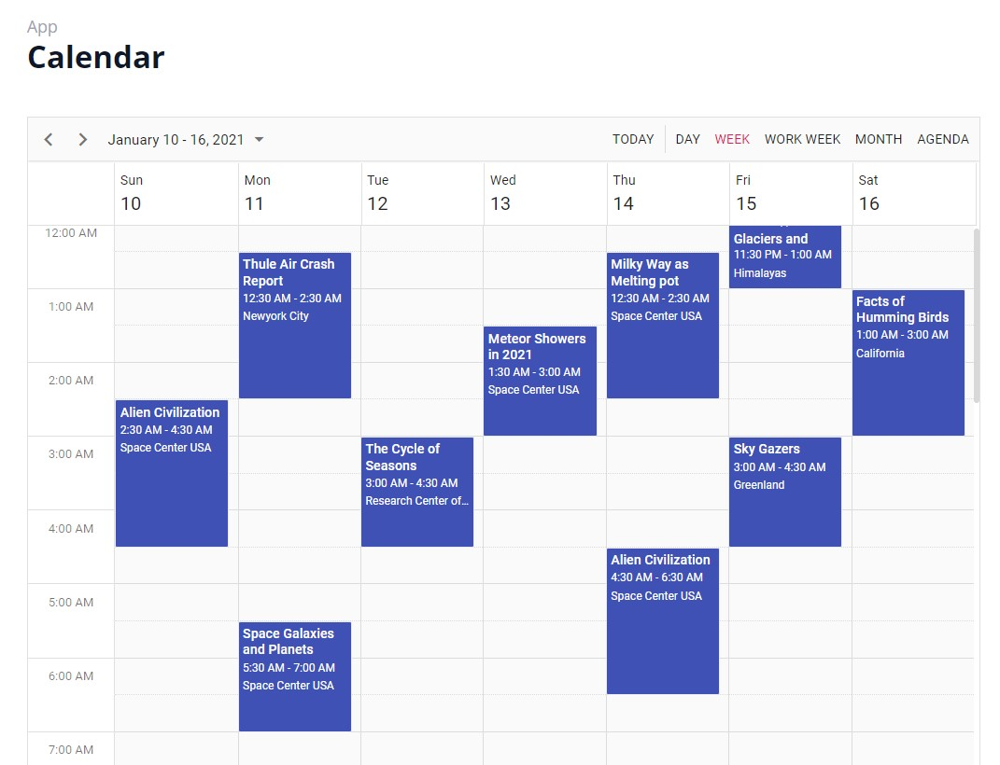

# React Dashboard

## Description

A React application that tests out the various apps, charts and tables from Syncfusion. The application also has the ability to switch the theme color, between a few set choices, and a light/dark mode.

## Table of Contents

- [Useage](#useage)
- [Technologies](#technologies)
- [License](#license)
- [Contact](#contact)
- [Links](#links)

## Useage

Visit [Shoppy](https://react-dashboard-rust.vercel.app/)

#### Desktop layout

The Home page has various anaylytics regarding a fictional ecommerce site. Click on the side menu to go to the various pages, apps, and charts.

### Pages example

### Apps example

## Charts example (dark mode)

Across the top is a navbar bar that allows you to open your cart, a chat, notifications, and a user profile.

### Shopping Cart

### Messages

### User Profile

## Technologies

React, JavaScript, React-Router, Syncfusion, HTML, TailwindCSS, and Vercel.

## License

Licensed under the [MIT](https://choosealicense.com/licenses/mit/) license

## Contact

Email: timmartin13@gmail.com

Github: [TimMartin13](https://github.com/TimMartin13)

## Links

Deployed link: https://react-dashboard-rust.vercel.app/

Repository link: https://github.com/TimMartin13/react-dashboard
